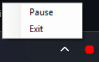

# GlobalKeylogger

## Description
A keylogger that logs keystrokes globally on a windows system. Used for generating data for training a keystroke continuous authentication model.
The tool was designed to generate data in the same format as the following dataset: https://www.sciencedirect.com/science/article/pii/S2352340923002445

## Usage/Installation

No installation required, just download the executable and run it.\
If you have .NET 8.0 installed you can use the ['/framework_dependent/GlobalKeyLogger.exe'](framework_dependent/GlobalKeyLogger.exe) if not you can use the ['/self_contained/GlobalKeyLogger.exe'](self_contained/GlobalKeyLogger.zip) version which is zipped due to file size limitations of github, it however is a self-contained executable that brings everything that you need to run it.
If you are unsure, just use the self-contained version, the file size is larger but it contains everything you need.

When running the program, it will minimize to the tray and immediately start logging keystrokes.
In the system tray you can Pause/Resume the logging, and Exit the program. 

\
The red dot indicates that it is currently recording and can be paused via right click and 'Pause'\
\
The blue pause button indicates that it is currently paused and can be resumed via right click and 'Resume'

## Logging

A .csv file is created next to the executable with the name keylog_<timestamp>.csv
The file contains VK,HT, and FT which stands for VirtualKeycode, HoldTime, and FlightTime

- VirtualKeycode: The virtual key code (https://learn.microsoft.com/en-us/windows/win32/inputdev/virtual-key-codes) in decimal of the key pressed
- HoldTime: The time in milliseconds the key was held down
- FlightTime: The time in milliseconds between the last key press and the current key press

Each new run of the program will create a new file with a new timestamp. Pausing and resuming will not create a new file, but will continue to log to the same file.
